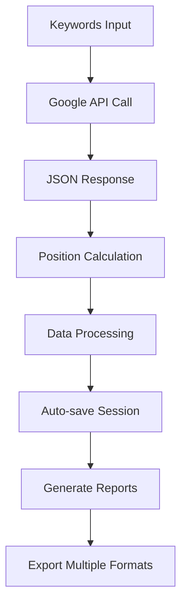

# 🔍 Keyword Position Scraper - Advanced Edition

**SCRAPER PROFESIONAL DE POSICIONES DE KEYWORDS CON REPORTES AVANZADOS**

Herramienta completa para análisis de posiciones SEO usando Google Custom Search API con sistema de reportes detallados, interfaz moderna y funcionalidades avanzadas.

## 🚀 Características Principales

### 🔧 Core Features
✅ **100% Google API** - Usa Custom Search API oficial de Google  
✅ **Sin anti-detección** - API oficial = accesos garantizados  
✅ **Sin proxies** - Google maneja las cuotas internacionalmente  
✅ **Credenciales persistentes** - API Key y Search Engine ID guardados  
✅ **API de calidad** - Posiciones reales de resultados de búsqueda  
✅ **Cuotas claras** - 100 consultas gratis/día, costos predecibles  

### 🎨 Interfaz y UX
✅ **Interfaz Ultra Moderna** - CustomTkinter con diseño profesional  
✅ **Tema Oscuro Avanzado** - Colores inspirados en Neil Patel  
✅ **Navegación por Pestañas** - Organización intuitiva de funciones  
✅ **Indicadores en Tiempo Real** - Progreso, estadísticas y logs  
✅ **Controles Inteligentes** - Botones de inicio, parada y reinicio  

### 📊 Sistema de Reportes Avanzado
✅ **Reportes JSON Detallados** - Almacenamiento estructurado de sesiones  
✅ **Análisis Estadístico** - Métricas de rendimiento y competencia  
✅ **Exportación HTML** - Reportes visuales profesionales  
✅ **Gráficos Interactivos** - Distribución de posiciones y análisis  
✅ **Gestión de Sesiones** - Historial completo de scraping  

### 🔄 Funcionalidades Avanzadas
✅ **Auto-guardado** - Sesiones guardadas automáticamente
✅ **Keywords Relacionadas** - Sugerencias de Google Suggest
✅ **Análisis de Competencia** - Identificación de dominios top
✅ **Filtros Inteligentes** - Limpieza y deduplicación automática
✅ **Múltiples Formatos** - Exportación CSV, JSON y Excel

### 🆕 **Funcionalidades Híbridas** (NUEVO)
✅ **Integración Search Console** - Combina datos reales con scraping
✅ **Detector de Oportunidades** - Keywords con alto ROI potencial
✅ **Comparación de Posiciones** - SC vs Scraper en tiempo real
✅ **Gaps de Contenido** - Identifica keywords sin cobertura
✅ **Score de Visibilidad** - Métrica combinada de rendimiento SEO
✅ **Sincronización Automática** - Keywords de SC a lista de scraping
✅ **Reportes Híbridos HTML** - Análisis visual profesional
✅ **Recomendaciones Accionables** - Insights automáticos priorizados

📖 **[Ver documentación completa de funcionalidades híbridas](HYBRID_FEATURES.md)**

### 🔐 **Autenticación Mejorada de Search Console** (NUEVO)
✅ **Auto-Refresh de Tokens** - Sin interrupciones ni re-autenticación
✅ **Sistema Multi-Cuenta** - Múltiples clientes sin re-autenticar
✅ **Validación Automática de URLs** - Detección y corrección de formatos
✅ **Caché Inteligente** - 10-30x más rápido en operaciones repetitivas
✅ **Manejo Robusto de Errores** - Mensajes claros y accionables
✅ **Logging Profesional** - Visibilidad total de operaciones
✅ **100% Retrocompatible** - Tu código existente sigue funcionando

🔒 **[Ver documentación de mejoras de autenticación](AUTH_MEJORAS.md)**  

## 📦 Instalación

### Requisitos Previos
- Python 3.8 o superior
- pip (gestor de paquetes de Python)
- Conexión a internet

### Instalación de Dependencias
```bash
git clone <tu-repo>
cd scraper-keyword-position
pip install -r requirements.txt
```

### Ejecución
```bash
python run_gui.py
```

## 🏗️ Compilación a Ejecutable

### Windows
```cmd
cd windows
build_windows.bat
```

### Linux
```bash
cd linux
chmod +x build_linux.sh
./build_linux.sh
```

Los ejecutables se generarán en las carpetas `dist/` respectivas.

## ⚙️ Configuración

### 1. Configuración de Google API

Edita `config/.env`:

```env
# 🚀 GOOGLE API CONFIGURACIÓN
# Obtén tu API Key: https://console.cloud.google.com/apis/credentials
GOOGLE_API_KEY=tu_api_key_aqui

# Obtén tu Search Engine ID: https://programmablesearchengine.google.com/controlpanel/all (copia después de 'cx=')
GOOGLE_SEARCH_ENGINE_ID=tu_search_engine_id_aqui

# ➡️ USO DE GOOGLE API (siempre verdadero)
USE_GOOGLE_API=true

# Delays entre keywords (segundos)
MIN_KEYWORD_DELAY=5
MAX_KEYWORD_DELAY=15

# Configuración geográfica
DEFAULT_COUNTRY=US
DEFAULT_LANGUAGE=en
PAGES_TO_SCRAPE=1
```

### 2. Obtener Credenciales de Google

#### API Key:
1. Ve a [Google Cloud Console](https://console.cloud.google.com/apis/credentials)
2. Crea un nuevo proyecto o selecciona uno existente
3. Habilita la "Custom Search API"
4. Crea credenciales → API Key
5. Copia la API Key generada

#### Search Engine ID:
1. Ve a [Google Custom Search Engine](https://cse.google.com/)
2. Crea un nuevo motor de búsqueda
3. Configura para buscar en "toda la web"
4. Copia el ID que aparece después de 'cx=' en la URL

## 🔧 Uso de la Aplicación

### **Interfaz Gráfica Moderna**
```bash
python run_gui.py
```

### **🌟 Flujo de Trabajo Completo:**

#### 1. **Configuración Inicial:**
   - **Pestaña "🔐 Google API"**: Configura credenciales
   - Ingresa API Key y Search Engine ID
   - Presiona "**✅ Validar Credenciales API**"

#### 2. **Gestión de Keywords:**
   - **Pestaña "🔑 Keywords"**: Carga o ingresa keywords
   - Usa "**📁 Cargar desde Archivo**" (formato: una keyword por línea)
   - O ingresa manualmente en el área de texto

#### 3. **Configuración Avanzada:**
   - **Pestaña "⚙️ Configuración"**: Ajusta parámetros
   - Configura delays entre consultas
   - Establece dominio objetivo (opcional)
   - Ajusta configuración geográfica

#### 4. **Ejecución del Scraping:**
   - **Pestaña "🚀 Scraping"**: Controla el proceso
   - "**🧪 Probar API**": Valida configuración
   - "**🚀 Iniciar Scraping**": Comienza análisis
   - "**⏹️ Detener**": Para el proceso
   - "**🔄 Reiniciar**": Reinicia scraping

#### 5. **Análisis de Resultados:**
   - **Pestaña "📊 Resultados"**: Visualiza datos
   - Tabla interactiva con posiciones encontradas
   - Estadísticas en tiempo real
   - Exportación a múltiples formatos

#### 6. **Sistema de Reportes:**
   - **Pestaña "📋 Reportes"**: Gestiona sesiones
   - Historial completo de scraping
   - Reportes HTML profesionales
   - Análisis estadístico avanzado

### **💡 Funcionalidades Avanzadas:**

#### Auto-guardado Inteligente:
- Cada sesión se guarda automáticamente
- Reportes JSON con metadatos completos
- Recuperación de sesiones interrumpidas

#### Análisis de Competencia:
- Identificación automática de dominios competidores
- Distribución de posiciones por dominio
- Métricas de rendimiento comparativo

#### Keywords Relacionadas:
- Sugerencias automáticas de Google Suggest
- Expansión inteligente de keywords
- Filtrado y deduplicación automática

## 📁 Estructura del Proyecto

```
scraper-keyword-position/
├── run_gui.py                    # 🚀 Punto de entrada principal
├── src/
│   ├── gui.py                    # Interfaz gráfica moderna con CustomTkinter
│   ├── stealth_scraper.py        # Motor de scraping con Google API
│   ├── utils.py                  # Utilidades y análisis de datos
│   ├── reports.py                # Sistema de reportes y análisis
│   └── report_methods.py         # Métodos de gestión de reportes
├── config/
│   ├── .env                      # Configuración de credenciales API
│   └── settings.py               # Gestor de configuración centralizada
├── data/                         # Directorio de resultados exportados
│   ├── sessions/                 # Reportes JSON de sesiones
│   ├── exports/                  # Archivos CSV y Excel exportados
│   └── html_reports/             # Reportes HTML generados
├── logs/                         # Logs detallados del scraper
├── windows/                      # Build para Windows
│   ├── build_windows.bat         # Script de compilación automática
│   ├── scraper.spec              # Configuración PyInstaller
│   └── README_BUILD.md           # Instrucciones de compilación
├── linux/                       # Build para Linux
│   ├── build_linux.sh            # Script de compilación automática
│   ├── scraper.spec              # Configuración PyInstaller
│   └── README_BUILD.md           # Instrucciones de compilación
├── keywords_ejemplo.txt          # Keywords de ejemplo para testing
├── requirements.txt              # Dependencias del proyecto
└── README.md                     # Esta documentación completa
```

## 🔍 Arquitectura y Funcionamiento

### **📋 Google Custom Search API - Funcionamiento Técnico**

Este scraper utiliza la **Google Custom Search JSON API** para obtener resultados de búsqueda idénticos a Google.com:

#### **1. 🚀 Proceso de Scraping:**

1. **Autenticación API:** Validación de credenciales Google
2. **Consulta Estructurada:** Llamadas REST con parámetros geográficos
3. **Procesamiento JSON:** Análisis de respuestas estructuradas
4. **Cálculo de Posiciones:** Asignación secuencial de rankings
5. **Auto-guardado:** Almacenamiento automático en múltiples formatos

#### **2. 📊 Flujo de Datos:**



#### **3. 🎯 Ventajas Técnicas:**

✅ **Precisión Garantizada:**
- Resultados idénticos a Google.com
- Posiciones calculadas matemáticamente
- Sin interferencia de personalización

✅ **Escalabilidad:**
- Cuotas predecibles (100 gratis/día)
- Sin límites de velocidad agresivos
- Procesamiento batch eficiente

✅ **Confiabilidad:**
- API oficial de Google
- Sin riesgo de bloqueos
- Uptime garantizado por Google
- Dependía del navegador y proxies
- Mayor riesgo de bloqueo

## 📊 Formatos de Salida

### CSV
```csv
keyword,position,title,url,domain,page,snippet
"marketing digital",3,"Cómo Hacer Marketing Digital - Guía Completa","https://example.com/guia","example.com",1,"Aprende todas las técnicas..."
```

### JSON
```json
[
  {
    "keyword": "marketing digital",
    "position": 3,
    "title": "Cómo Hacer Marketing Digital - Guía Completa",
    "url": "https://example.com/guia",
    "domain": "example.com",
    "page": 1,
    "snippet": "Aprende todas las técnicas de marketing digital en este guide completo..."
  }
]
```

## 🔍 Análisis de Resultados

En la aplicación gráfica, ve a pestaña "**📈 Análisis**" para generar gráficos automáticamente:

### Métricas incluidas:
- 📊 **Distribución de posiciones** - TOP 3, TOP 10, distribución general
- 🏆 **Top dominios** - Mejores posiciones por dominio
- 📈 **Resultados por página** - Crecimiento de posiciones paginadas
- 💡 **Boxplot de posiciones** - Estadísticas visuales
- 🏅 **Ranking por keywords** - Mejores posiciones por término

### Exportación automática:
- **CSV** y **JSON** con métricas completas
- Gráficos de distribución disponibles
- Históricos de posiciones por dominio

## 🚨 Notas Importantes

### ⚖️ Uso Responasable con Google API
- ✅ **Recomendado** - API oficial de Google
- 📊 **Cuotas transparentes** - 100 consultas/día gratis
- 🔒 **Sin bloqueos** - API garantizada
- 💰 **Costos claros** - $5 por cada 1000 consultas adicionales

### 📢 Recordatorios de API
- **🔑 API Key** segura - No shares tu clave
- **⚡ Rate Limiting** - Respeta los límites de Google
- **🌐 Geolocalización** - Resultados por país/idioma
- **🔄 Cuotas reset** - Se rellenan cada día

### 💡 Recomendaciones por Volumen
```python
# Para PROYECTOS PEQUEÑOS (≤100 keywords/día):
➡️ Configurar delays 5-15s (predeterminado)
➡️ Ideal para clientes personales

# Para CAMPANÍAS MEDIANAS (100-500 keywords/día):
➡️ Ubgrapes 100 consultas gratis diarias
➡️ Usar delays de 2-5s

# Para EMPRESAS GRANDES (>500 keywords/día):
➡️ Solo keywords estratégicas
➡️ $5 por cada 1000 consultas adicionales
```

### 🔧 Solución de Problemas

#### 🔐 Problemas de Credenciales
**"Sin API Key/Modelo Search Engine ID"**
- ✅ Verifica la pestaña "**🔐 Google API**"
- ✅ Asegúrate que la API Key empiece por `AIza`...
- ✅ El Search Engine ID debe ser similar a `e1afc530d3cd24be5`

**"Error 403: Forbidden"**
- ✅ El Search Engine ID no coincide con tu API Key
- ✅ Verifica que ambas credenciales sean de la misma cuenta

#### 📊 Problemas de Cuotas Google
**"DAILY_LIMIT_EXCEEDED"**
- ✅ Has agotado las 100 consultas diarias gratis
- ✅ Espera al día siguiente para reset automático
- ✅ O actualiza a plan pago

**"429: Too Many Requests"**
- ✅ Google está limitando temporalmente
- ✅ Espera unos minutos y continúa
- ✅ Reduce la frecuencia de consultas

#### 🔍 Problemas de Resultados
**"Sin resultados encontrados"**
- ✅ La keyword es demasiado específica
- ✅ El país/idioma puede no tener resultados
## 🚨 Solución de Problemas

### **🔧 Problemas Comunes de API**

#### **"API Key inválida"**
- ✅ Verifica que la API Key esté correcta en `config/.env`
- ✅ Asegúrate de haber habilitado Custom Search API en Google Cloud Console
- ✅ Revisa que no haya espacios extra en la configuración

#### **"Search Engine ID inválido"**
- ✅ Verifica el ID en [Google Custom Search Engine](https://cse.google.com/)
- ✅ Asegúrate de que el motor esté configurado para "toda la web"
- ✅ Copia el ID completo después de 'cx=' en la URL

#### **"Cuota excedida"**
- ✅ Google API permite 100 consultas gratis por día
- ✅ Revisa tu uso en [Google Cloud Console](https://console.cloud.google.com/)
- ✅ Considera habilitar facturación para más cuotas

### **📊 Problemas de Resultados**

#### **"No se encuentran posiciones"**
- ✅ Verifica que el dominio objetivo esté en los primeros 100 resultados
- ✅ Prueba con keywords más genéricos
- ✅ Revisa la configuración geográfica (país/idioma)

#### **"Posiciones inconsistentes"**
- ✅ Google API puede dar resultados diferentes por geolocalización
- ✅ Las posiciones varían según personalización y ubicación
- ✅ Usa configuración geográfica consistente

### **🖥️ Problemas Técnicos**

#### **"Error al iniciar la aplicación"**
- ✅ Asegúrate de tener Python 3.8+ instalado
- ✅ Instala dependencias: `pip install -r requirements.txt`
- ✅ Verifica CustomTkinter: `pip install customtkinter`

#### **"Error de conexión"**
- ✅ Verifica tu conexión a internet: `ping google.com`
- ✅ Revisa configuración de proxy/firewall
- ✅ Intenta desde otra red si es posible

#### **"Reportes no se generan"**
- ✅ Verifica permisos de escritura en directorio `data/`
- ✅ Asegúrate de tener espacio en disco suficiente
- ✅ Revisa logs en `logs/scraper.log` para errores específicos

## 📈 Roadmap y Futuras Mejoras

### **🎯 Próximas Versiones**
- [ ] **Dashboard Web**: Interfaz web para análisis remoto
- [ ] **API REST**: Endpoints para integración con otras herramientas
- [ ] **Base de Datos**: PostgreSQL/MySQL para almacenamiento persistente
- [ ] **Scraping Programado**: Tareas automáticas con cron/scheduler
- [ ] **Alertas Inteligentes**: Notificaciones por email/Slack
- [ ] **Análisis Competitivo**: Comparación automática con competidores

### **🔧 Mejoras Técnicas**
- [ ] **Múltiples APIs**: Integración con SerpAPI, DataForSEO
- [ ] **Machine Learning**: Predicción de tendencias de posiciones
- [ ] **Exportación Avanzada**: PowerBI, Tableau, Google Sheets
- [ ] **Monitoreo 24/7**: Tracking continuo de posiciones
- [ ] **Multi-idioma**: Soporte para múltiples idiomas
- [ ] **Clustering**: Agrupación inteligente de keywords

## 🤝 Contribuir al Proyecto

### **🚀 Cómo Contribuir**
1. **Fork** el repositorio
2. **Crea una branch**: `git checkout -b feature/nueva-funcionalidad`
3. **Desarrolla** tu funcionalidad con tests
4. **Commit** cambios: `git commit -am 'Añadir nueva funcionalidad'`
5. **Push** branch: `git push origin feature/nueva-funcionalidad`
6. **Crea Pull Request** con descripción detallada

### **📋 Áreas de Contribución**
- **Frontend**: Mejoras en la interfaz CustomTkinter
- **Backend**: Optimización del motor de scraping
- **Reportes**: Nuevos formatos y visualizaciones
- **Testing**: Casos de prueba y automatización
- **Documentación**: Guías y tutoriales
- **Traducción**: Soporte multi-idioma

## 📄 Licencia y Términos

### **⚖️ Licencia**
Este proyecto está bajo **Licencia MIT** - ver archivo `LICENSE` para detalles.

### **⚠️ Términos de Uso**
- **Uso Educativo**: Diseñado para aprendizaje y investigación SEO
- **Responsabilidad**: El usuario es responsable del cumplimiento de ToS
- **Límites de API**: Respeta las cuotas y límites de Google API
- **Uso Ético**: No uses para spam o actividades maliciosas

## 💬 Soporte y Comunidad

### **🆘 Obtener Ayuda**
1. **Revisa Logs**: Consulta `logs/scraper.log` para errores detallados
2. **Verifica Configuración**: Usa la pestaña de validación en la GUI
3. **Consulta FAQ**: Revisa esta documentación completa
4. **Abre Issue**: Crea un issue en GitHub con detalles del problema

### **📞 Canales de Soporte**
- **GitHub Issues**: Para bugs y feature requests
- **Documentación**: Esta guía completa
- **Logs Detallados**: Sistema de logging integrado
- **Validación Automática**: Herramientas de diagnóstico incluidas

### **🔍 Información de Debug**
Al reportar problemas, incluye:
- Versión de Python y sistema operativo
- Contenido de `logs/scraper.log`
- Configuración utilizada (sin credenciales)
- Pasos para reproducir el error
- Screenshots de la interfaz si es relevante

---

**🎉 ¡Gracias por usar Keyword Position Scraper Advanced Edition!**

**⚠️ Disclaimer**: Esta herramienta es para uso educativo y de investigación SEO. El uso responsable y el cumplimiento de los términos de servicio de Google API es responsabilidad del usuario.
